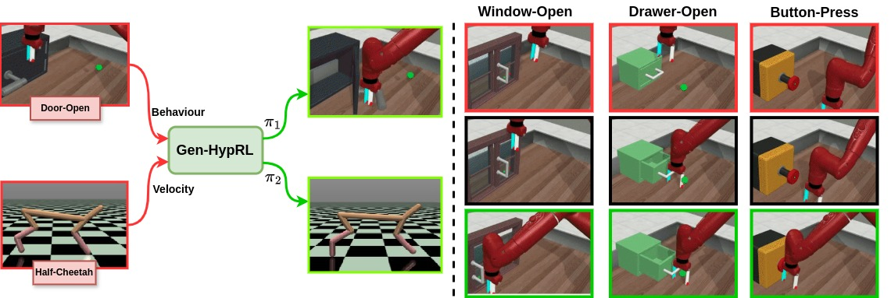

# Gen-HypRL : Generative Policy learning Framework for Multi-Task Reinforcement Learning

A key challenge in building generalist agents is enabling them to perform multiple tasks while simultaneously adapting to variations across the tasks efficiently, particularly in a zero-shot manner. Multi-task Reinforcement Learning (MTRL) is a paradigm that enables agents to learn a single policy that can be deployed to perform multiple tasks in a given environment. A straightforward approach like parameter sharing introduces challenges such as conflicting gradients and determining the optimal way to distribute shared parameters across tasks. In this work, we introduce Gen-HypRL, a framework for training hypernetworks in MTRL that consists of HypLatent, an adversarial autoencoder that generates diverse task conditioned latent policy parameters, and HypFormer, a single layer transformer that performs soft-weighted aggregation on these priors towards expert policy parameters. Our approach not only outperforms previous hypernetwork based methods but also performs comparably to the existing state-of-the-art methods in MTRL on MetaWorld benchmark. Additionally, experiments on MuJoCo continuous control tasks demonstrate the framework’s strong zero-shot learning capabilities, allowing it to generalize to unseen in-distribution tasks without additional fine-tuning. Our framework also achieves performance comparable to state-of-the-art offline meta-RL methods.

 \
[[Paper Link]](paper/Gen_HypRL_Generative_Policy.pdf) [[Project Website]](https://gen-hyprl.github.io/)


# 1) Environment Setup :

## 1.1) Install the environment using [link](https://github.com/cheryyunl/Make-An-Agent). 
Especially step1 & step2 for the installation. Also run, Dataset and Pretrained Models steps for the same link. Once this is done follow the steps below:
```bash
$ conda activate makeagent
$ cd Make-An-Agent/
$ git clone https://github.com/Gen-HypRL/gen-hyprl_code.git
$ cd gen-hyprl_code/
```
# 2) Training HypLatent-GAN :
Before running 'train_cond_behaviour_unet1d.py' file, change the path to save the weights.
```
# Inside train_cond_behaviour_unet1d.py
...
...
WEIGHTS_PATH = "path_to_save_hyplatent_weights/"
...
...
```
Now, run the training step as follows,
```bash
$ python train_cond_behaviour_unet1d.py
```
For using our best checkpoint download from this [link](https://drive.google.com/file/d/1xywGK9krgTvz2dmyvQcugWrPZP04fEeX/view?usp=sharing). Also, the best expected checkpoint is around 3400 epoch.

# 3) Evaluate HypLatent-GAN on MetaWorld environment:
Once you get the best checkpoint either by training or by downloading it from the [link](https://drive.google.com/file/d/1xywGK9krgTvz2dmyvQcugWrPZP04fEeX/view?usp=sharing). Evaluate it as follow on the meta world,
```bash
$ python eval_aae.py
```

# 4) Training SampleNet8 Transformer :
Before running 'train_unet1d_samplenet_residue.py' file, change the path to save the weights and resume weights paths.
```
# Inside train_unet1d_samplenet_residue.py
...
...
WEIGHTS_PATH = "path_to_save_samplenet8_weights/"
WEIGHTS_RESUME = "path_to_save_hyplatent_weights/checkpoint3400_seed43.pth"
...
...
```
Now, run the sampleNet8 training step as follows,

```
$ python train_unet1d_samplenet_residue.py
```
For using our best checkpoint download from this [link](https://drive.google.com/file/d/1zSBtUcEuQ7zEfZqu7vIERbReMy_dLcvH/view?usp=drive_link). Also, the best expected checkpoint is around 1550 epoch.

# 5) Evaluate SampleNet8 on MetaWorld :
Once you get the best checkpoint either by training or by downloading it from the [link](https://drive.google.com/file/d/1zSBtUcEuQ7zEfZqu7vIERbReMy_dLcvH/view?usp=drive_link). Evaluate it as follow on the meta world,
```
$ python eval_aae_samplenet_res.py
```
